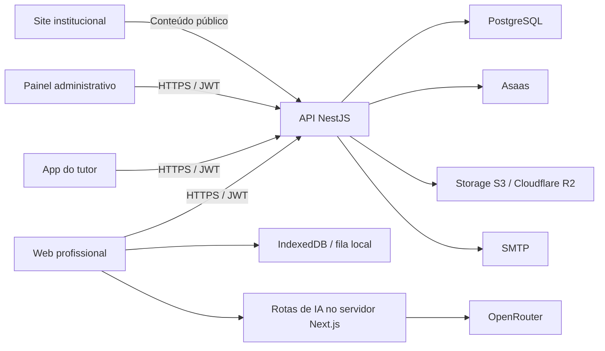

# Arquitetura



## Responsabilidades

- **API:** regras de negócio, persistência, autenticação, autorização e integrações de pagamento, arquivo e e-mail.
- **Web:** operação da clínica, documentos e formulários clínicos. A camada offline mantém dados consultados e operações elegíveis no navegador, sincronizando com a API.
- **App:** experiência do tutor, acesso aos animais, conteúdo compartilhado, notas próprias, perfil e pagamentos.
- **Admin:** operação do SaaS, empresas, usuários, planos, cupons, assinaturas, anúncios e tutoriais.
- **Institucional:** apresentação do produto, parceiros, tutoriais e páginas informativas; encaminha o acesso profissional para a web.
- **IA:** as rotas `app/api/*` da web chamam OpenRouter no servidor Next.js. Essa integração pertence à web.

## Organização da API

`src/infra/main.ts` inicia o NestJS. O fluxo usual é:

```text
controller + DTO → serviço de aplicação → interface de repositório
                                        → implementação Prisma → PostgreSQL
                     ↓
                  presenter → resposta HTTP
```

`src/core` contém tipos base e `Either`; `src/domain`, entidades, serviços e interfaces; `src/infra`, HTTP, banco e provedores externos.

## Identidade e escopo

| Ator | Identidade | Uso do escopo |
|---|---|---|
| Profissional (`User`) | JWT com `sub`, `companyId`, `type: user` | Operações da clínica |
| Tutor (`Client`) | JWT com `sub`, `type: client`, `companyId: no-company` | Recursos vinculados ao proprietário |
| Equipe (`AdminUser`) | JWT administrativo | Operações autorizadas pelo perfil administrativo |

O `AuthGuard` global valida o JWT e a situação atual da conta. Guards específicos e verificações de vínculo nos serviços complementam a autorização. Em rotas da clínica, obtenha o escopo do token com `@CurrentCompanyId()`. Rotas administrativas recebem identificadores de empresas como alvo da operação, sob os guards administrativos.

As escritas autenticadas com `Idempotency-Key` passam pelo interceptor de idempotência. A fila offline usa esse contrato. Consulte [ADR 0004](../decisions/0004-offline.md).

## Execução

A API escuta na porta `3333` por padrão (`PORT` permite alterar). Swagger: `/api`; Scalar: `/reference`. A configuração atual de clientes referencia `https://api.equinology.com.br`. Endereços e processos de publicação estão em [deploy](../guides/operations/deploy.md).
